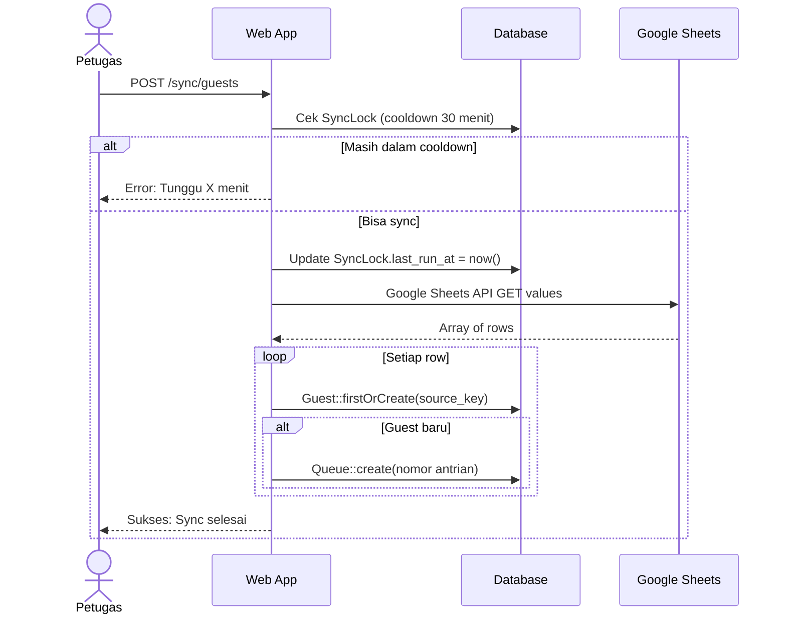
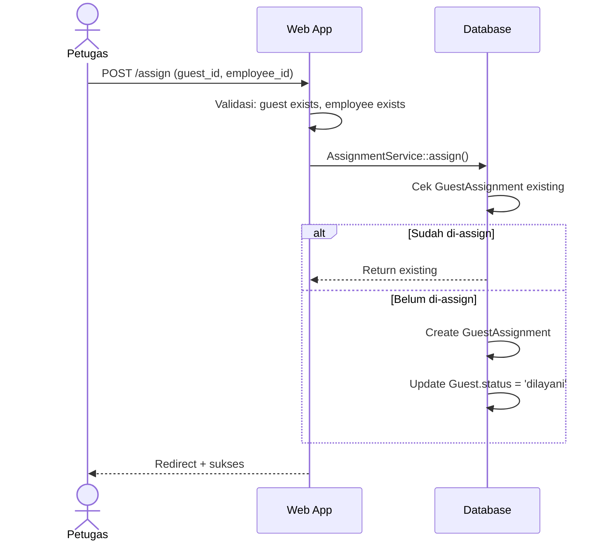

# 🏗️ ARCHITECTURE — Arsitektur Aplikasi

Dokumen ini menjelaskan arsitektur teknis, alur data, dan keputusan desain dari aplikasi **Guest Book BPS**.

---

## Gambaran Umum

**Guest Book BPS** adalah aplikasi web monolitik berbasis Laravel yang berfungsi sebagai sistem manajemen buku tamu digital. Data tamu berasal dari Google Form yang diisi tamu secara mandiri, kemudian disinkronkan ke database aplikasi secara on-demand oleh petugas.

```
Google Form (Tamu mengisi) 
       ↓
Google Sheets (Respons tersimpan)
       ↓  [Sync via API]
Guest Book App (Database lokal)
       ↓
Petugas: Assign, Antrian, Laporan
```

---

## Layer Arsitektur

Aplikasi menggunakan arsitektur berlapis (Layered Architecture) dengan 4 layer:

```
┌─────────────────────────────────────────┐
│             PRESENTATION LAYER          │
│   Blade Templates + Alpine.js + Vite    │
├─────────────────────────────────────────┤
│            APPLICATION LAYER            │
│    HTTP Controllers + Form Requests     │
├─────────────────────────────────────────┤
│             DOMAIN / SERVICE LAYER      │
│     AssignmentService + QueueService    │
├─────────────────────────────────────────┤
│              DATA ACCESS LAYER          │
│     Eloquent Models + Query Builder     │
└─────────────────────────────────────────┘
```

---

## Struktur Direktori

```
app/
├── Console/
│   └── Commands/
│       └── SyncGuests.php       ← Artisan command: sync dari Google Sheets
│
├── Http/
│   └── Controllers/
│       ├── Controller.php        ← Base controller
│       ├── DashboardController.php  ← KPI & statistik real-time
│       ├── GuestController.php      ← Daftar & detail tamu
│       ├── AssignmentController.php ← Assign pegawai ke tamu
│       ├── EmployeeController.php   ← CRUD pegawai
│       ├── ReportController.php     ← Laporan bulanan + PDF
│       ├── SyncController.php       ← Trigger sync manual
│       ├── ProfileController.php    ← Manajemen profil user
│       └── Auth/                    ← Auth controllers (Breeze)
│
├── Models/
│   ├── Guest.php            ← Data tamu dari Google Form
│   ├── Employee.php         ← Data pegawai pelayan
│   ├── GuestAssignment.php  ← Relasi tamu ↔ pegawai
│   ├── Queue.php            ← Nomor antrian harian
│   ├── SyncLock.php         ← State cooldown sync
│   └── User.php             ← Pengguna sistem
│
├── Services/
│   ├── AssignmentService.php  ← Logic assign + update status
│   └── QueueService.php       ← Logic generate nomor antrian
│
├── Actions/     ← (kosong, disiapkan untuk future use)
└── Helpers/     ← (kosong, disiapkan untuk future use)
```

---

## Komponen Kunci

### 1. SyncGuests Command

**File**: `app/Console/Commands/SyncGuests.php`  
**Signature**: `php artisan sync:guests`

Artisan command yang menghubungi Google Sheets API, membaca baris data, dan melakukan `firstOrCreate` ke tabel `guests` berdasarkan `source_key` (MD5 hash untuk deduplication).

```
Google Sheets API
      ↓
  mapRow()   ← normalisasi & validasi
      ↓
  source_key = MD5(nama + tanggal + email + form_email)
      ↓
  Guest::firstOrCreate(['source_key' => ...])
      ↓ (jika baru)
  QueueService::generate()  ← nomor antrian otomatis
```

**Deduplication Logic**:
- Setiap baris dari Google Sheets diidentifikasi dengan `source_key`
- Jika `source_key` sudah ada, row dilewati (tidak duplikat)
- Jika baru, record dibuat + antrian digenerate

### 2. AssignmentService

**File**: `app/Services/AssignmentService.php`

Mengelola proses assignment tamu ke pegawai dengan jaminan transaksional:

```php
DB::transaction(function() {
    // Cek apakah tamu sudah di-assign (idempotent)
    $existing = GuestAssignment::where('guest_id', $guestId)->first();
    if ($existing) return $existing;

    // Buat assignment baru
    GuestAssignment::create([...]);

    // Update status tamu: menunggu → dilayani
    Guest::where('id', $guestId)->update(['status' => 'dilayani']);
});
```

### 3. QueueService

**File**: `app/Services/QueueService.php`

Menghasilkan nomor antrian secara atomic per tanggal:

```php
DB::transaction(function() {
    // Lock for update untuk mencegah race condition
    $last = Queue::where('queue_date', $date)->lockForUpdate()->max('queue_number');
    $next = ($last ?? 0) + 1;
    Queue::create(['queue_number' => $next, ...]);
});
```

### 4. SyncLock Mechanism

**Model**: `app/Models/SyncLock.php`  
**Tabel**: `sync_locks`

Mekanisme cooldown 30 menit untuk mencegah sync berlebihan:

```
[Petugas klik Sync]
        ↓
  SyncLock::where('key', 'guests')->first()
        ↓
  last_run_at + 30 menit > now() ?
        ↓ Ya             ↓ Tidak
  Tolak + countdown   Update last_run_at
                             ↓
                    Artisan::call('sync:guests')
```

---

## Alur Data Utama

### Alur Sync Tamu



### Alur Assignment Tamu



---

## Tech Stack Detail

| Layer | Teknologi | Versi | Fungsi |
|---|---|---|---|
| Framework | Laravel | 12.x | Core web framework |
| Language | PHP | 8.2+ | Backend language |
| Frontend | Blade | - | Server-side templating |
| CSS | Tailwind CSS | 3.x | Utility-first styling |
| JS | Alpine.js | 3.x | Lightweight reactivity |
| Build | Vite | 7.x | Asset bundler |
| Database | MySQL | 8.x | Relational database |
| Queue | Laravel Queue | DB driver | Background job processing |
| Auth | Laravel Breeze | 2.x | Authentication scaffolding |
| PDF | DomPDF | - | Generate laporan PDF |
| External | Google Sheets API | v4 | Sumber data tamu |

---

## Keputusan Desain

### Mengapa Sync Manual (Bukan Otomatis)?

- **Kontrol petugas**: Petugas dapat memutuskan kapan data perlu diperbarui
- **Rate limiting**: Mencegah spam request ke Google API
- **SyncLock cooldown 30 menit**: Melindungi dari double-click dan abuse

### Mengapa Service Layer?

- `AssignmentService` dan `QueueService` dipisahkan dari controller untuk:
  - Dapat di-reuse dari controller maupun artisan command
  - Logic bisnis terpisah dari transport layer
  - Lebih mudah di-test secara unit

### Mengapa `source_key` MD5?

- Google Sheets tidak memiliki ID unik yang stabil per baris
- MD5 dari kombinasi `nama + tanggal + email + form_email` menghasilkan fingerprint yang cukup deterministik untuk deduplication
- Trade-off: Jika data berubah di Sheets, record dianggap baru (acceptable karena form entry biasanya final)

### Mengapa Queue untuk Sync?

- `Artisan::call('sync:guests')` berjalan synchronously di dalam HTTP request
- Untuk dataset besar, pertimbangkan dispatch ke Queue Job agar tidak timeout
- Queue connection `database` sudah dikonfigurasi di `.env`

---

## Routing Overview

```
GET  /                          → redirect ke /login
GET  /dashboard                 → DashboardController@index (auth, verified)

[auth middleware]
GET  /guests                    → GuestController@index
GET  /guests/{guest}            → GuestController@show
POST /assign                    → AssignmentController@store

GET  /report/monthly            → ReportController@monthly
GET  /report/monthly/pdf        → ReportController@monthlyPdf

POST /sync/guests               → SyncController@run

GET    /employees               → EmployeeController@index
POST   /employees               → EmployeeController@store
GET    /employees/create        → EmployeeController@create
GET    /employees/{id}          → EmployeeController@show
PUT    /employees/{id}          → EmployeeController@update
DELETE /employees/{id}          → EmployeeController@destroy (soft-deactivate)
PATCH  /employees/{id}/activate → EmployeeController@activate

GET    /profile                 → ProfileController@edit
PATCH  /profile                 → ProfileController@update
DELETE /profile                 → ProfileController@destroy
```
